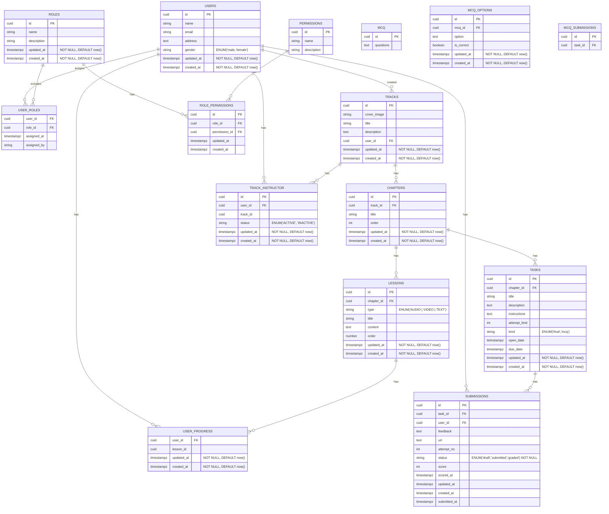

# HSI SANDBOX LMS DATABASE ERD

## Entity Relationship Diagram

[CLICK TO VIEW IN MERMAID LIVE EDITOR](https://mermaid.live/edit#pako:eNrFV21v4jgQ_iuWpRWtFKpAWo7mG0fZXVTejoTV6oQUmcRQq4mddZy7dtv-97XzVkcB2t2VFoGUeDwezzyeeTx5gj4LMLRhu91eU0EEtsEafnbGwEE02LAHMJk6a7im2fyaYn5D0I6jaE0BWDmjpQOen9tt9pQNvOV8MnKADVCSkB1NlFIu2qdEqB-mAU4aptzlYHirNHyOkcBBw4waeIvRcjp2nPF85tjgDmVmNJnUBUr5oG6xS6EGhp8HC1c5USlUklJFeuDoFhoK7sC5fZ0uY8rnnNXfTReU_lGNuo3MZW88c9zlaujOl4diOahXM5cdxmI5_7SUcVUqRZCVrX1a6lcae1KvAPgpCYD8L27zcSI4oTtAUYRrAhwhEuYSgR8EQEHAcZLUdHaYBpjLPBzNVtOzVoRCbIAtVs_WuUrGbDWJcCJQFH8HaRyoNPGQkGtmcxfMVpOJAW5GHweriQso-_9s37Iiu96x7CUPOM_BnwxYJrjPSSwIoydzXCs73fs0wdyTz4-3mpCzEOtCbd-8qrONayFW8s1jLv_wAfgsilki-UQCBM6KnYzS-rnmnF6zv4etdkzeO6zuDTcTxphHRAbF6AEkXg_uyOEcwKJmfC8iRTUfB8Nn_ylMI7SrYyI5PMRagTXyb-_RnyApK_Y8djyCI_9ed7QZJaECMC4J42SRlJR5LBD_DsWijnkZymOMK64brG7Gc_AMvoxvRurpjr66r5x34Ih9RgWmRb7RNNpI8jwtIvnF9ot4vJXAmZRQqZ76Spq85gESAkex8EISkTpH3RMaVChvCUVhy2hF_jftQsEkKuJlMaaeQqqBRJDi_RN_ClmtSTheOCi5b_Bao-oVkluMg42sMk2U8rCJKWU1QGUAIk0qSAOOtkJCmqQbCb0MSb7LPjGQL-egDKwEQJlNfMabMGbSvbz6E5Sr2yvdKSZ1htUapGNI7r0lS146Bslg6I6_jFoGaI1nxfspu5daI_d2HxDKriy7ok7ksLw3ozQUJA6xJAtGfAy-pdJWQQPT4T-H8j9L4VI30RCQa7z5wn2zdiQtNKqEaQS0YfLORhSQxJPpyrEvTnaoKiSNEt7PCC_QgDtOAmhLGsUGjGRXgtQQZjbWUNxh2W1B9TkYIH6vdlVrYkT_ZSwql3GW7u6gvUVhIkd51MUXYiVFqWDOI_WrNVl7P2QpFdDuWJ1eLzML7Sf4AO32Zf_ywuxdd687pvlXz7zuG_BRirt966LTu7q0utdm58q0rBcDfs886VxYHavXN_uWedXtm2bXMiAOiGB8mn_bZp-4Lz8Acq69Uw)

this is the minimal ERD for the HSI Sandbox LMS, it's currently incomplete and is work in progress.

